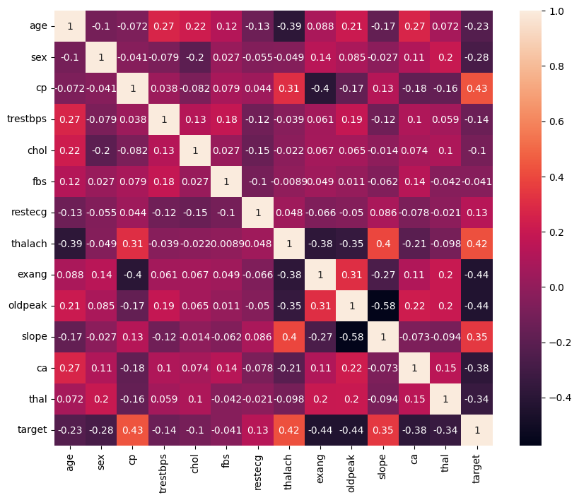

# Laporan Proyek Machine Learning

### Nama : Ikhsan Al Fajar

### Nim : 211351062

### Kelas : Pagi B

## Domain Proyek

Data ini berisi mengenai beberapa aspek yang berkaitan dengan penderita penyakit jantung, yang dapat digunakan sebagai indikator yang menentukkan apakah ada kondisi-kondisi yang sama yang dimiliki oleh seluruh penderita penyakit jantung

## Business Understanding

Perkiraan ini dapat membantu guna melihat indikator atau kesamaan apa saja yang dimiliki oleh penderita penyakit jantung

Bagian laporan ini mencakup:

### Problem Statements

Menjelaskan pernyataan masalah latar belakang:

- Tingginya angka penderita penyakit jantung namun kurang tingginya sosialisasi mengenai penyebab serta gejala-gejala yang dapat menjadi indikasi dari penyakit jantung itu sendiri

### Goals

Menjelaskan tujuan dari pernyataan masalah:

- Guna mensosialisasikan beberapa gejala atau kondisi-kondisi yang berpotensi menjadi penyakit jantung, sehingga diharapkan masyarakat dapat menyadari sedari dini mengenai penyakit jantung

Semua poin di atas harus diuraikan dengan jelas. Anda bebas menuliskan berapa pernyataan masalah dan juga goals yang diinginkan.

### Solution statements

- Pengembangan platform dari data kondisi yang telah disurvei dari beberapa penderita penyakit jantung berisi mengenai beberapa indikator seperti tekanan darah, kadar gula darah, kadar kolestrol, dll. sehingga dapat didapat beberapa kesimpulan dari kesamaan kondisi yang diderita oleh penderita penyakit jantung. Beberapa indikator yang disurvei kemungkinan besar berpengaruh dalam menjadi penyebab penyakit jantung itu sendiri, dan diharapkan dapat mensosialisasi masyarakat luas agar menyedari sedari dini apabila sudah terlihat ada indikator dari penyakit jantung yang terdapat di platform
- Model yang dihasillkan dari datasets ini menggunakan metode KNN.

## Data Understanding

Adapun beberapa indikator yang diyakini menjadi penyebab dari penyakit jantung diantaranya tekanan darah, kadar gula darah, kadar kolestrol, frekuensi detak jantung, sehingga bisa memprediksi apakah seseorang dengan indikator diatas terkena penyakit jantung atau tidak.

[Heart Disease Dataset](https://www.kaggle.com/datasets/johnsmith88/heart-disease-dataset).

Selanjutnya menguraikan seluruh variabel atau fitur pada data

### Variabel-variabel pada Global Video Game Sales adalah sebagai berikut:

- age : menunjukkan usia (int64)
- sex : menunjukkan jenis kelamin (int64)
- cp : menunjukkan jenis nyeri dada (int64)
- trestbps : menunjukkan tekanan darah (int64)
- chol: menunjukkan kolestrol (int64)
- fbs : menunjukkan gula darah (int64)
- restecg : menunjukkan hasil elektrokardiografi (int64)
- thalach : menunjukkan detak jantung maksimum (int64)
- exang : menunjukkan angina akibat olahraga (int64)
- oldpeak : menunjukkan oldpeak (int64)
- slope : menunjukkan kemiringan puncak latihan segmen ST (int64)
- ca : Menunjukkan jumlah pembuluh besar (int64)
- thal : menunjukkan 0 = biasa; 1 = cacat tetap; 2 = cacat yang dapat dibalik (int64)
- target : menunjukkan mengacu pada adanya penyakit jantung pada pasien. Bernilai bilangan bulat 0 = tidak ada penyakit dan 1 = sakit
  (int64)

## Data Preparation

## Data Collection

Untuk data collection ini, saya mendapatkan dataset yang nantinya digunakan dari website kaggle dengan nama dataset Heart Disease

## Import dataset

Karena kita menggunakan google colab untuk mengerjakannya maka kita akan import files

```bash
from google.colab import files
```

Lalu mengupload token kaggle agar nanti bisa mendownload sebuah dataset dari kaggle melalui google colab

```bash
file.upload()
```

Setelah mengupload filenya, maka kita akan lanjut dengan membuat sebuah folder untuk menyimpan file kaggle.json yang sudah diupload tadi

```bash
!mkdir -p ~/.kaggle
!cp kaggle.json ~/.kaggle/
!chmod 600 ~/.kaggle/kaggle.json
!ls ~/.kaggle
```

lalu mari kita download datasetsnya

```bash
!kaggle datasets download -d johnsmith88/heart-disease-dataset
```

Selanjutnya kita harus extract file yang tadi telah didownload

```bash
!mkdir heart-disease-dataset
!unzip heart-disease-dataset.zip -d heart-disease-dataset
!ls heart-disease-dataset
```

## Library yang digunakan

```bash
import pandas as pd
import numpy as np
import seaborn as sns
import matplotlib.pyplot as plt
from sklearn.model_selection import train_test_split
from sklearn.neighbors import KNeighborsClassifier
from sklearn.metrics import confusion_matrix, classification_report
from sklearn.datasets import make_classification
from sklearn.decomposition import PCA
```

## Data discovery

Mari lanjut dengan memasukkan file csv yang telah diextract pada sebuah variable, dan melihat 5 data paling atas dari datasetsnya

```bash
df = pd.read_csv('heart-disease-dataset/heart.csv')
df.head()
```

Untuk melihat mengenai type data dari masing masing kolom kita bisa menggunakan property info,

```bash
df.info()
```

ringkasan statistik deskriptif dari DataFrame

```bash
df.describe()
```

menampilkan dimensi dari DataFrame, yaitu jumlah baris dan kolomnya

```bash
df.shape
```

## EDA

Selanjutnya kita akan memeriksa apakah datasetsnya terdapat baris yang kosong atau null dengan menggunakan seaborn,

```bash
sns.heatmap(df.isnull())
```

 <br>

Mari kita lanjut dengan data exploration kita,

```bash
plt.figure(figsize=(10,8))
sns.heatmap(df.corr(), annot=True)
```



Selanjutnya menampilkan perbandingan antara yang tidak punya penyakit dan yang punya penyakit

```bash
df.target.value_counts().plot(kind='bar', color=['#A0C49D', '#E1ECC8']);
plt.title("Heart Disease")
plt.xlabel("0 = No Diesease, 1 = Disease")
plt.ylabel("Amount")
plt.xticks(rotation=0);
```


Membandingkan jumlah kategori dalam kolom target berdasarkan kategori dalam kolom sex

```bash
pd.crosstab(df.target, df.sex).plot(kind='bar',
                                   figsize=(10,6),
                                   color=['#0F4C75','#3282B8'])
```


Membandingkan frekuensi dari 2 kategori dalam kolom fbs berdasarkan jenis kelamin 'sex'

```bash
fig = pd.crosstab(df.sex, df.fbs).plot(kind = 'bar', color = ['lightblue', 'salmon'])
plt.title("Fasting blood sugar w.r.t sex")
fig.set_xticklabels(labels=['fbs>120 mg/dl', 'fbs<120 mg/dl'], rotation=0)
plt.legend(['Female', 'Male']);
```


Menampilkan plot jumlah data dalam kolom 'exang' yang dibagi berdasarkan jenis kelamin 'sex'

```bash
fig = sns.countplot(x = 'exang', data = df, hue = 'sex')
plt.title('Exercise induced angina for sex')
fig.set_xticklabels(labels=["Doesn't have exang", 'Has exang'], rotation=0)
plt.legend(['Female', 'Male']);
```


## Preprocessing

Merubah tipe data pada kolom oldpeak menjadi integer

```bash
df['oldpeak'] = df['oldpeak'].astype('int64')
print("\nTipe data setelah perubahan:")
print(df.dtypes)
```

cek kolom kosong pada dataset

```bash
df.isna().sum()
```

## Modeling

Langkah pertama adalah memasukkan kolom-kolom fitur yang ada di datasets dan juga kolom targetnya,

```bash
features = ['age','sex','cp','trestbps','chol','fbs','restecg','thalach','exang','oldpeak','slope','ca','thal']
x = df[features]
y = df['target']
x.shape, y.shape
```

Selanjutnya kita akan menentukan berapa persen dari datasets yang akan digunakan untuk test dan untuk train

```bash
x_train, X_test, y_train, y_test = train_test_split(x,y,random_state=70)
y_test.shape
```

lalu membuat mode dan memasukkan X_train dan y_train pada model dan memasukkan value predict pada y_pred,

```bash
KNN=KNeighborsClassifier(n_neighbors=11)
KNN.fit(x_train,y_train)
y_pred=KNN.predict(X_test)
```

sekarang kita bisa melihat score dari model kita,

```bash
score = KNN.score(X_test, y_test)
print('akurasi model knn = ', score)
```

Lumayan, 0.708171206225681, mari kita test menggunakan sebuah array value

Mari kita coba simulasi prediksi dengan KNN

```bash
input_data = np.array([[52,1,0,125,212,0,1,155,0,3.1,2,2,3]])

prediction = KNN.predict(input_data)
print(prediction)
if(prediction[0]==0):
  print('Pasien tidak adanya penyakit jantung')
else:
  print('Pasien adanya penyakit jantung')
```

Selanjutnya membuat visualisasi dari confusion matrix (matriks kebingungan) yang dihasilkan dari model klasifikasi.

```bash
cm = confusion_matrix(y, KNN.predict(x))

fig, ax = plt.subplots(figsize=(8, 8))
ax.imshow(cm)
ax.grid(False)
ax.xaxis.set(ticks=(0, 1), ticklabels=('Predicted 0s', 'Predicted 1s'))
ax.yaxis.set(ticks=(0, 1), ticklabels=('Actual 0s', 'Actual 1s'))
ax.set_ylim(1.5, -0.5)
for i in range(2):
    for j in range(2):
        ax.text(j, i, cm[i, j], ha='center', va='center', color='red')
plt.show()
```


berhasil!!, sekarang modelnya sudah selesai, mari kita export sebagai sav agar nanti bisa kita gunakan pada project web streamlit kita.

## Evaluation

Disini saya menggunakan f1 score sebagai metrik evaluasi.

F1 score adalah metrik evaluasi yang digunakan dalam permasalahan klasifikasi untuk mengukur keseimbangan antara presisi (precision) dan recall. F1 score menggabungkan kedua metrik ini menjadi satu skor tunggal dan berguna ketika keseimbangan antara false positives dan false negatives penting dalam konteks tertentu.

Rumus F1 score adalah:
precision = TP / (TP + FP)
recall = TP / (TP + FN)

f1*score = 2 * (precision \_ recall) / (precision + recall)

Setelah itu saya menerapkannya dalam kode menggunakan fungsi f1 score, seperti berikut :

```bash
print(classification_report(y_test, y_pred))
```

dan hasil yang saya dapatkan adalah 0.72, itu berarti model ini memiliki keseimbangan yang lumayan baik antara presisi dan recall.

## Visualisasi hasil algoritma

```bash
x, y = make_classification(n_samples=100, n_features=13, n_classes=2, n_clusters_per_class=1, random_state=70)

pca = PCA(n_components=2)
x_pca = pca.fit_transform(X_test)

y_pred = KNN.predict(X_test)

plt.scatter(x_pca[:, 0], x_pca[:, 1], c=y_pred, cmap=plt.cm.Paired)
plt.xlabel('thal')
plt.ylabel('thalach')
plt.title('Visualisasi Prediksi KNN pada Data Uji (Setelah PCA)')
plt.show()
```


## Save model (pickle)

```bash
import pickle

filename = 'heart_disease.sav'
pickle.dump(KNN,open(filename,'wb'))
```

## Deployment

[My Prediction App](https://heartdisease-ikhsan.streamlit.app/).


##
